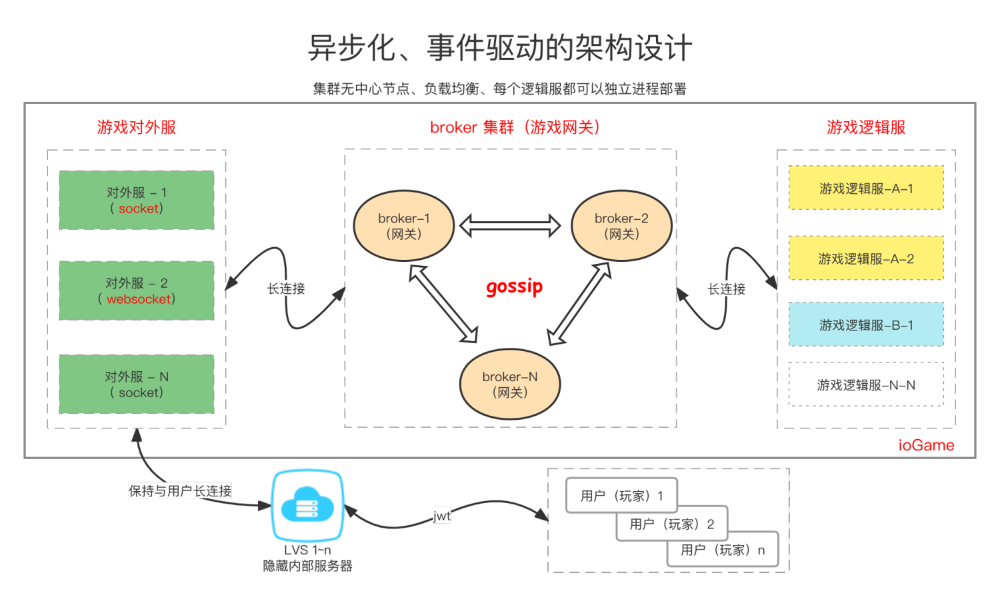
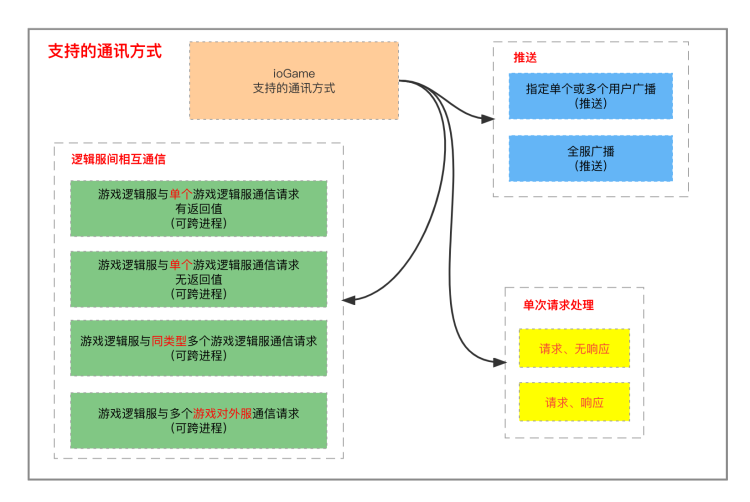
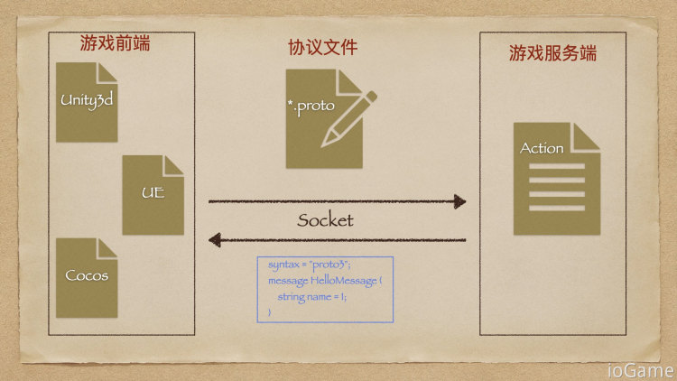

## iogame是什么？
java写的网络游戏服务框架，支持websocket和tcp

## websocket是什么？
是一种通信协议，它的最大特点就是，服务器可以主动向客户端推送信息，客户端也可以主动向服务器发送信息

## SOFABolt?
SOFABolt 是一个基于 Netty 最佳实践的轻量、易用、高性能、易扩展的通信框架。

## 游戏网关
broker （游戏网关）可以集群的方式部署，集群无中心节点、自带负载均衡。ioGame 本身就包含服务注册，你不需要外接一个服务注册中心，如 Eureka，ZooKeeper 等（变相的节约服务器成本）。

## 逻辑服
逻辑服通常说的是游戏对外服和游戏逻辑服。逻辑服可以有很多个，逻辑服扩展数量的理论上限是 netty 的连接上限。

## 游戏对外服
对外服保持与用户（玩家）的长连接。

##ioGame 支持的通讯方式

# 游戏与服务端的交互方式

## 协议文件
协议文件是对业务数据的描述载体，用于游戏前端与游戏服务器的数据交互。
.proto 文件可以给游戏前端的同学。

##Protocol Buffers 
是Google公司开发的一种数据描述语言，也简称 PB。当然协议文件描述还可以是 json、xml或者任意自定义的，因为最后传输时会转换为二进制，但游戏开发中 PB 是目前的最佳。

