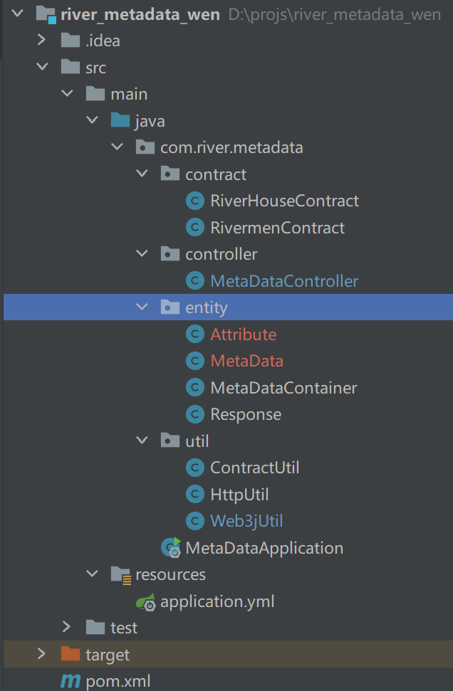

## 使用ABI文件生产java本版的Contract
命令行输入
```
web3j generate solidity -a abi文件 -o 输出目录 -p 包名
```
命令行工具可以来这里下载
```
https://github.com/web3j/web3j-cli/releases/tag/v1.4.1
```

## 创建maven项目
### pom依赖
```xml
<?xml version="1.0" encoding="UTF-8"?>
<project xmlns="http://maven.apache.org/POM/4.0.0"
         xmlns:xsi="http://www.w3.org/2001/XMLSchema-instance"
         xsi:schemaLocation="http://maven.apache.org/POM/4.0.0 http://maven.apache.org/xsd/maven-4.0.0.xsd">
    <modelVersion>4.0.0</modelVersion>
    <parent>
        <groupId>org.springframework.boot</groupId>
        <artifactId>spring-boot-starter-parent</artifactId>
        <version>2.7.2</version>
        <relativePath/> <!-- lookup parent from repository -->
    </parent>
    <groupId>groupId</groupId>
    <artifactId>river_metadata_wen</artifactId>
    <version>1.0-SNAPSHOT</version>
    <build>
        <plugins>
            <plugin>
                <groupId>org.apache.maven.plugins</groupId>
                <artifactId>maven-compiler-plugin</artifactId>
                <configuration>
                    <source>8</source>
                    <target>8</target>
                </configuration>
            </plugin>
        </plugins>
    </build>
    <dependencies>
        <dependency>
            <groupId>org.springframework.boot</groupId>
            <artifactId>spring-boot-starter-web</artifactId>
        </dependency>
        <!--web3j-->
        <dependency>
            <groupId>org.web3j</groupId>
            <artifactId>core</artifactId>
            <version>4.8.4</version>
        </dependency>
        <dependency>
            <groupId>org.projectlombok</groupId>
            <artifactId>lombok</artifactId>
        </dependency>

    </dependencies>
    
</project>
```
## 目录结构


## util包
### ContractUtil
根据合约地址返回对应的合约
```java

public class ContractUtil {

    private static Credentials credentials = Credentials.create("1");

    private static String riverMenContractAddresses = "0xcfff4c8c0df0e2431977eba7df3d3de857f4b76e";

    private static String riverHouseContractAddresses = "0xf66d1e00f4882c48dba369947234b54884a01129";

    public static RivermenContract getRiverMenContact(Web3j web3j) {
        return RivermenContract.load(riverMenContractAddresses, web3j, credentials, new DefaultGasProvider());
    }

    public static RivermenContract getRiverHouseContact(Web3j web3j) {
        return RivermenContract.load(riverHouseContractAddresses, web3j, credentials, new DefaultGasProvider());
    }

}

```
### HttpUtil
根据tokenId拿metadata，封装了RestTemplate
```java
public class HttpUtil {

    //获取rivermen metadata的url
    private static String RIVER_MEN_URL = "https://api.rivermen.io/rivernft/metadata/";
    //获取riverhouse metadata的url
    private static String RIVER_HOUSE_URL = "https://api.rivermen.io/airdrop/riverestate/";

    private static RestTemplate restTemplate = new RestTemplate();

    public static MetaData getRiverMenMetaData(Long tokenId){
        return getData(RIVER_MEN_URL + tokenId, MetaData.class);
    }

    public static MetaData getRiverHouseMetaData(Long tokenId){
        return getData(RIVER_HOUSE_URL + tokenId, MetaData.class);
    }

    public static <T> T getData(String url, Class<T> clazz){
        return restTemplate.getForObject(url, clazz);
    }
}
```
### Web3jUtil
```java
@Component
@Slf4j
public class Web3jUtil {

    /**
     * 从application.yml读取远程地址
     * 用于创建web3j实例
     */
    @Value("${web3j.rpcUrlList}")
    private List<String> rpcUrlList;

    /**
     * 从application.yml读取最大实例数
     * 最大实例数
     * maxNum最好 >= rpcUrlList.size()
     */
    @Value("${web3j.maxNum}")
    private Integer maxNum;

    /**
     * 存实例
     * 阻塞队列
     */
    private ArrayBlockingQueue<Web3j> blockingQueue;

    private void init(){
        //初始化代码块
        blockingQueue = new ArrayBlockingQueue<>(maxNum);
        //创建web3j的实例，外层循环循环maxNum，表示会创建maxNum个web3j实例；
        // 内层循环循环rpc地址列表的大小，从前往后依次创建rpc地址为rpcUrlList.get(j)的web3j的实例
        for (int i = 0, j = 0; i < maxNum; i++, j++) {
            if (j == rpcUrlList.size()) {
                j = 0;
            }
            HttpService httpService = new HttpService(rpcUrlList.get(j));
            Web3j web3j = Web3j.build(httpService);
            blockingQueue.add(web3j);
        }
    }

    /***
     * 若队列为空就直接返回空
     * 不为空就返回实例
     * @return Web3j
     */
    public Web3j getWeb3j(){
        //单例模式
        if (blockingQueue == null){
            synchronized (Web3jUtil.class){
                if (blockingQueue == null){
                    init();
                }
            }
        }
        return blockingQueue.poll();
    }

    /**
     * 用完了就放回来
     * @param web3j web3j
     */
    public void put(Web3j web3j){
        if (web3j == null) {
            return;
        }
        blockingQueue.add(web3j);
    }
}

```
## controller
### MetaDataController
```java
@RestController
@Slf4j
public class MetaDataController {

    @Resource
    Web3jUtil web3jUtil;

    //获取metadata的接口，get，post请求都可以
    @RequestMapping("/metadata")
    public Response getMetadata(@RequestBody Map<String, List<String>> owners) {
        //获取一个web3j实例
        Web3j web3j = web3jUtil.getWeb3j();
        //若获取到的实例为空，说明实例队列已无web3j实例
        if (web3j == null) {
            return Response.fail("服务器繁忙");
        }
        try {
            //获取传入的钱包地址列表
            List<String> list = owners.get("ownner");
            //生成合约实例
            RivermenContract rivermenContract = ContractUtil.getRiverMenContact(web3j);
            //生成合约实例
            RivermenContract riverHouseContract = ContractUtil.getRiverHouseContact(web3j);
            //要返回的列表
            List<MetaDataContainer> metaDataList = new ArrayList<>();
            //遍历钱包地址列表
            for (String owner : list) {
                //获取河里人的metadata
                //获取钱包地址拥有多少个nft
                int riverMenNFTCount = rivermenContract.balanceOf(owner).send().intValue();
                //遍历每个nft
                for (int i = 0; i < riverMenNFTCount; i++) {
                    MetaDataContainer container = new MetaDataContainer();
                    //设置合约类型
                    container.setContract(1);
                    //设置合约地址
                    container.setOwnner(owner);
                    //根据nft个数获取每个nft的tokenId
                    long tokenId = rivermenContract.tokenOfOwnerByIndex(owner, i).send().longValue();
                    container.setTokenId(tokenId);
                    //根据tokenId获取metadata，这里使用封装的工具类
                    MetaData riverMenMetaData = HttpUtil.getRiverMenMetaData(tokenId);
                    container.setMetadata(riverMenMetaData);
                    metaDataList.add(container);
                }
                //获取河里宅的metadata
                //获取钱包地址拥有多少个nft
                int riverHouseNFTCount = riverHouseContract.balanceOf(owner).send().intValue();
                for (int i = 0; i < riverHouseNFTCount; i++) {
                    MetaDataContainer container = new MetaDataContainer();
                    container.setContract(2);
                    container.setOwnner(owner);
                    //根据nft个数获取每个nft的tokenId
                    long tokenId = riverHouseContract.tokenOfOwnerByIndex(owner, i).send().longValue();
                    container.setTokenId(tokenId);
                    //根据tokenId获取metadata
                    MetaData riverHouseMetaData = HttpUtil.getRiverHouseMetaData(tokenId);
                    container.setMetadata(riverHouseMetaData);
                    metaDataList.add(container);
                }
            }
            Map<String, List<MetaDataContainer>> res = new HashMap<>();
            res.put("list", metaDataList);
            //返回结果
            return Response.ok(res);
        }catch (Exception e){
            log.error(e.getMessage());
        }finally {
            //把web3j实例放回去
            web3jUtil.put(web3j);
        }
        return Response.fail();
    }
}

```
