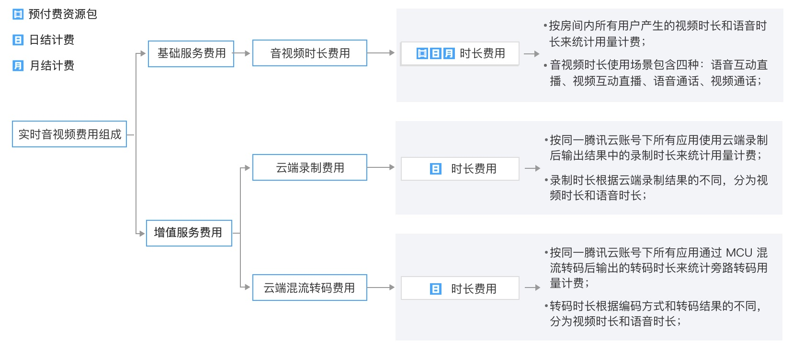
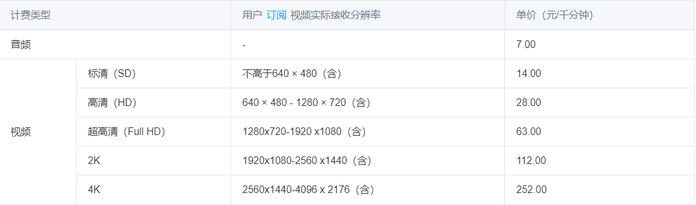
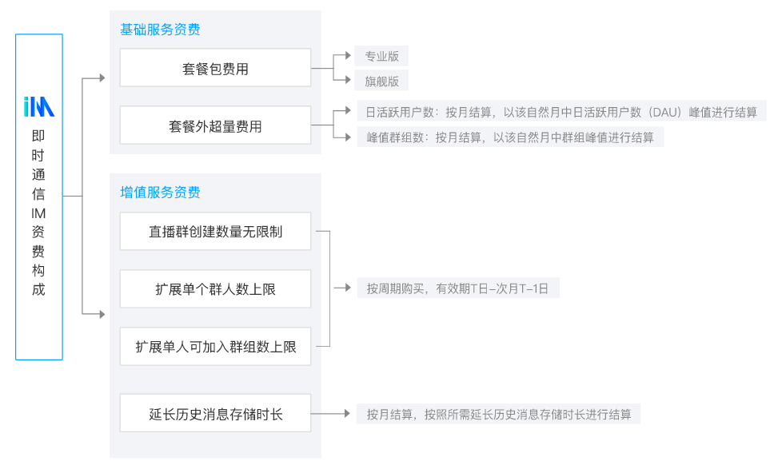
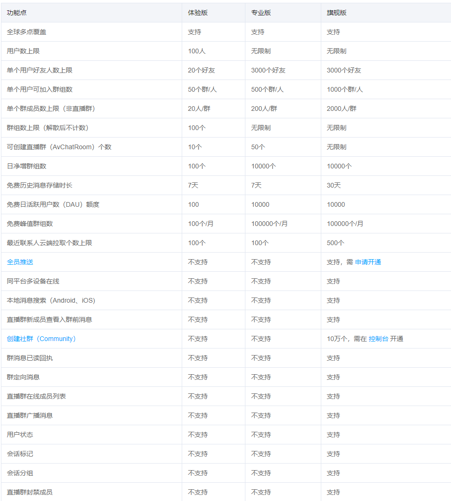
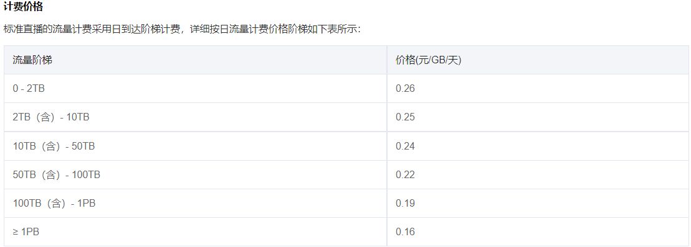
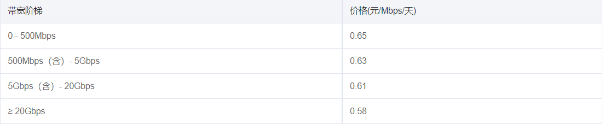

# 要开通两个服务
## 1.实时音视频
- 基础服务
- 增值服务

### 计费说明
#### 计费公式
`音视频时长费用 = 音频时长用量 × 音频单价 + 视频各分辨率档位时长用量 × 相应视频分辨率档位单价`
#### 计费价格

https://cloud.tencent.com/document/product/647/17157
https://cloud.tencent.com/document/product/647/44248
## 2.即时通信：
即时通信 IM 目前采用如下计费方式：
- 体验版免费
- 套餐包预付费：按周期购买，有效期T日 - 次月T-1日。
- 月结后付费：按自然月结算，每月1-3日扣除上一个自然月所产生的费用。

  https://cloud.tencent.com/document/product/269/11673
  
# 旁路直播
## 概念
基于UDP传输协议的TRTC服务，通过RTMP协议转换将音视频流对接到云直播系统，这个过程称之为“旁路转推”。

## 注意
若浏览器不支持webrtc，只能使用标准直播线路观看。
默认只有超低延时直播，如果需要支持快直播和标准直播需要开通旁路直播。
## 计费方式
将旁路转推用于CDN直播观看 时，云直播将会按直播观看产生的下行流量/带宽收取相关费用
https://cloud.tencent.com/document/product/267/34175

- 直播流量
  
- 带宽费用
  

