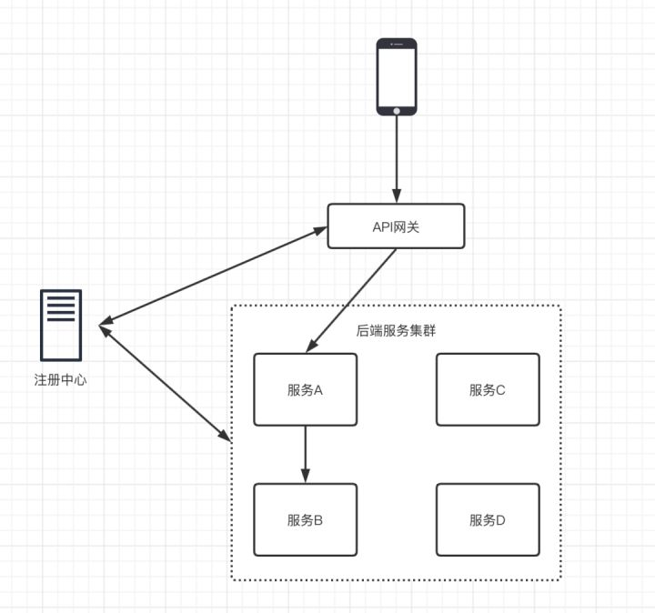

微服务是分布式的一种

传统单体架构
优点：
架构简单，前期容易开发
好部署，运维成本低
缺点：
项目后期会难以维护
无法灵活扩展，不能只要扩展一个业务

分布式
优点：
细分业务，易于扩展
缺点：
不好部署
对技术有一定要求

微服务要解决的问题
1.服务之间的调用问题
简单想法是直接把要调用的服务的ip和端口写在代码里，但这种做法不灵活。因为另一个服务的ip和端口
都是可以变的。解决方法是引入一个注册中心，所有服务都把自己注册到注册中心上，只需要名字即可调
用对应的服务
服务注册中心有zookeeper，nacos
2.服务调用用什么实现？
有基于dubbo的dubbo协议，也有基于http的openfeign
https://cloud.tencent.com/developer/article/2022676

3.若需要限流，安全，负债均衡怎么办？
引入网关，在SpringCloud中网关技术包括两种：gateway和zuul
其中Zuul是基于Servlet的实现，属于阻塞式编程，而Gateway则是基于SPring5中提供的WebFlux，
属于响应式编程的实现，具备更好的性能。

在微服务架构中，我们都会使用API网关来作为暴露服务的唯一出口。
这样可以将与业务无关的各项控制，集中的在API网关中进行统一管理，从而使得业务服务可以更加专注于业务领域本身。

https://www.cnblogs.com/mingyueyy/p/16366360.html