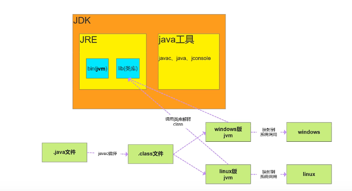

* JDK是Java开发工具，提供给开发人员用的
* JRE是java运行时环境，运行java程序时所需要的类库
* JVM时java虚拟机，解释和执行class文件

* JDK包含JRE和java工具
* JRE包含JVM和JVM运行时所需的类库

**运行过程**
```text
一个java文件首先通过javac命令编译成class文件，
jvm再调用jre类库解释class文件，将class文件的逻辑映射成对应系统的实际调用
```




