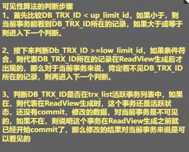

https://baijiahao.baidu.com/s?id=1719749867568105953&wfr=spider&for=pc
## 数据库并发会出现的问题
读读： 不存在安全问题
读写：存在安全问题，可能会造成事务隔离性问题。脏读，不可重复读，幻读
写写：由线程安全问题，丢失更新问题，第一类丢失更新，第二类更新丢失

# MVCC
多版本并发控制(Multi-Version Concurrency Control)
是一种解决读写问题的无锁并发实现，为事务分配单向增长的时间戳，为每个修改保存一个版本，版本与事务时间戳关联，读操作只读该事务开始前的数据库的快照
不能解决丢失更新问题
# 原理
依赖3个隐藏字段，undolog ，read view和可见性算法来实现
## 三个隐藏字段
- DB_TRX_ID 记录最近更新该行的事务id
- DB_ROLL_PTR 指向回滚数据的指针，指向上一个版本，与undolog配合
- DB_ROW_ID 隐藏的主键，若表没有主键，innodb会自动生成6字节的row_id

## undo日志
DB_ROLL_PTR指针形成的链表

## read view
事务进行快照读时产生的读视图。当执行快照读时，生成当前数据库系统的一个快照，记录并维护当前活跃事务的id

## 可见性算法
### 读视图的关键3个变量
- trx_list 当前系统活跃的事务id列表
- up_limit_id 活跃事务列表中最小的事务id
- low_limit_id 当前read view生产时刻系统未分配的下一个事务id

# RC(READ COMMITTED)和RR(REPEATABLE READ)在Innodb下快照读有什么区别？
在RC下，每个快照读都会生产最新的read view。在RR下，同一个事务的第一个快照读才会生产read view，其后续快照读都是用同一个read view

