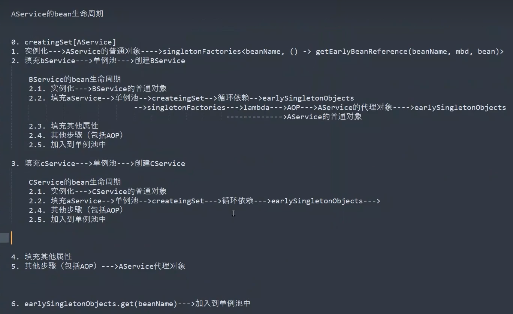

# spring bean创建步骤

```text
1得到xxx.class
2推断构造方法并使用构造方法得到普通对象（优先指定构造方法，然后是无参）
3依赖注入
    3.1初始化前(@PostConstruct)
    3.2初始化(afterPropertiesSet)
    3.3初始化后(AOP)
        3.3.1代理对象
4普通对象变为bean对象（经过了依赖注入）
5放入Map单例池
```

# spring事务
```text
基于aop
开启事务需要@EnableTransactionManagement
```
## spring事务的步骤
```text
1.开启spring事务
2.事务管理器建立一个数据库连接
    2.1关闭数据库连接的自动提交
        2.1.1调用代理对象的方法
    2.2提交事务(若有异常则回滚)
```
## 使用@Transactional的注意事项
### 这种情况是不生效的
因为是代理对象调用原对象的addPermissionToRole的方法，原对象此时并没有事务存在，所以不会抛出异常
```java
@Service
public class RoleServiceImpl implements RoleService {

    @Resource
    RoleMapper roleMapper;
    

    @Transactional
    public boolean addRole(Role role){
        addPermissionToRole(role.getRoleId());
    }
    
    //addPermissionToRole的事务不会生效，即不会抛出事务已存在异常
    @Transactional(propagation = Propagation.NEVER)
    public boolean addPermissionToRole(Integer id){
        
    }
}

```
### 解决方法
自己注入自己，这样拿到的是代理对象，由代理对象去调用方法
```java
@Service
public class RoleServiceImpl implements RoleService {

    @Resource
    RoleMapper roleMapper;
    
    @Resource
    RoleService roleService;
    
    @Transactional
    public boolean addRole(Role role){
//        addPermissionToRole(role.getRoleId());
        roleService.addPermissionToRole(role.getRoleId());
    }

    @Transactional(propagation = Propagation.NEVER)
    public boolean addPermissionToRole(Integer id){

    }
}
```
# spring怎么解决循环依赖


## @Lazy也能解决循环依赖
原理是生成代理对象

# 
