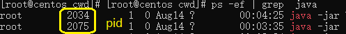

# 1.Thread.sleep(0)的作用是什么？
```text
Thread.yield()和Thread.sleep(0)语义实现取决于具体的jvm虚拟机，
某些jvm可能什么都不做，而大多数虚拟机会让线程放弃剩余的cpu时间片，
重新变为runnable状态，并放到同优先级线程队列的末尾等待cpu资源。
但是当我们调用Thread.yield()的那一刻，并不意味着当前线程立马释放cpu资源，
这是因为获得时间片的线程从runnable切换到running仍需要一定的准备时间，
这段时间当前线程仍可能运行一小段时间。
```
# 2.java中如何或许线程的dump文件？
## linux（centos）
思路：先获取进程pid，再通过kill -3 pid查看堆栈
### 获取进程pid命令
```shell
ps -ef | grep jar包名
```

### 
### 打印dump文件
```shell
kill -3 pid
```
```text
使用命令后会在 
/proc/${pid}/cwd
生成保存堆栈信息的文件
```

##  通用
```text
再java中使用
Thread.dumpStack();
打印堆栈信息
```
# 3.为什么启动线程不能直接调用run方法
```text
调用 start 方法可启动线程并使线程进入就绪状态，
等待分配时间片后会自动执行run方法；
如果在当前线程直接调用run方法，只会被当作普通方法运行
```

# 4.sleep()和wait()的异同？
## 相同点
```text
停止：
两者都可以暂停线程的执行，都会让线程进入等待状态。
```
##不同点
```text
锁：
sleep()方法没有释放锁，而 wait()方法释放了锁。

作用对象：
sleep()方法属于Thread类的静态方法，作用于当前线程；而wait()方法是Object类的实例方法，作用于对象本身

唤醒方法：
执行sleep()方法后，可以通过超时或者调用interrupt()方法唤醒休眠中的线程；
执行wait()方法后，通过调用notify()或notifyAll()方法唤醒等待线程。
```
# 线程池的优点？
```text
复用：
减少对象创建销毁的开销
易于管理：
单独创建的线程不好管理，操作不当可能存在资源泄露等问题
易于扩展：
可以较方便的实现定时执行、定期执行、单线程、并发数控制等功能。
```

# “伪共享是什么”？如何避免？
## Java 8 中的解决方案
```text
Java 8 中已经提供了官方的解决方案，Java 8 中新增了一个注解： 
@sun.misc.Contended
加上这个注解的类会自动补齐缓存行，需要注意的是此注解默认是无效的，需要在 jvm 启动时设置 
-XX:-RestrictContended
才会生效。
```
# Lock和Synchronized有什么区别？
```text
能用Synchronized就用Synchronized
```

```text
设计一个只允许多个用户读，一个用户写的高速缓存
使用读写锁，其他用户只能获取读锁，只有一个用户能获取写锁
```
