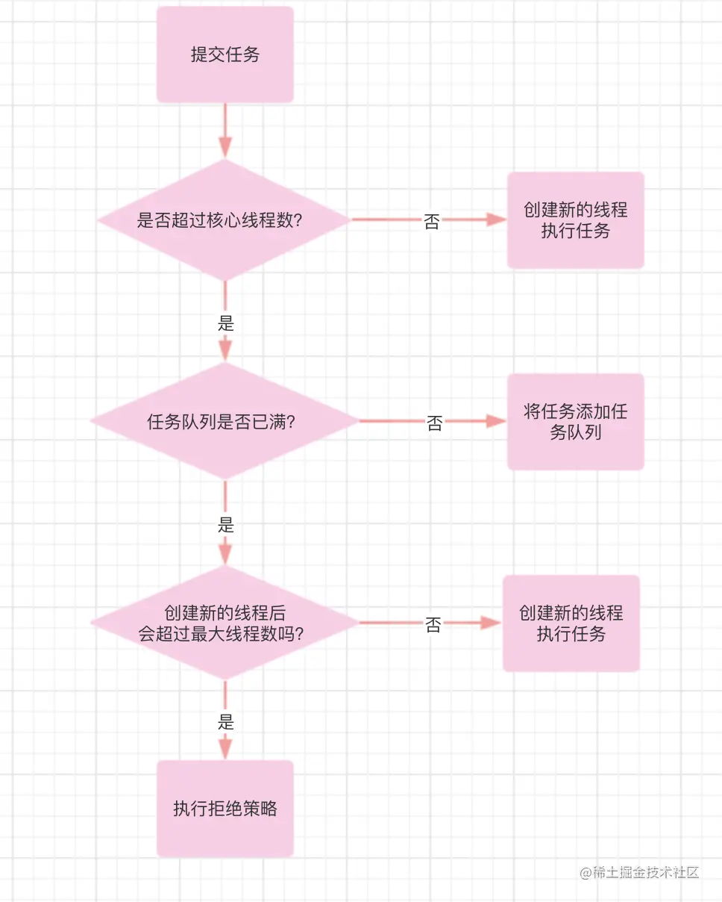

# 意义
1. 降低资源消耗，提高线程利用率（防止多次创建线程）
2. 提高响应速度，有任务一般可以直接执行，省去创建线程的时间
3. 提高线程的可管理性，使用线程池可以统一分配调优监控

# 参数
1. corePoolSize: 核心线程数
2. maximumPoolSize: 线程池允许存在的最大线程数量
3. keepAliveTime: 非核心线程的存活时间
4. unit: 非核心线程存活时间的单位
5. workQueue: 任务队列，通常是阻塞队列，常见有ArrayBlockingQueue、LinkedBlockingQueue、SynchronousQueue、PriorityBlockingQueue等
    - ArrayBlockingQueue底层实现是数组，数组初始化需指定大小，因此为有界队列
    - LinkedBlockingQueue底层实现是链表，默认大小是Integer.MAX_VALUE，因为过于大称之为无界队列
    - SynchronousQueue是不存元素的阻塞队列，每个插入操作需等另一个线程调用了移除操作后，该线程才会返回，否则一直阻塞
    - PriorityBlockingQueue按元素优先级排序的阻塞队列，优先级越高越先出队，是无界队列
6. threadFactory：线程池工厂，用来创建线程
7. RejectedExecutionHandler： 拒绝策略。任务队列满了且线程数量满了，线程池不会再接受新的任务。
    - AbortPocily： 抛出异常，默认用这个
    - CallerRunsPolicy： 交由提交任务的线程处理
    - DiscardPolicy： 不处理，直接丢弃
    - DiscardOldestPolicy： 丢弃在任务队列中等待时间最长的任务，后将该任务加入队列

# 过程
